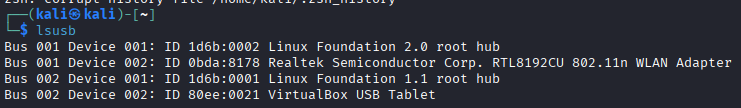
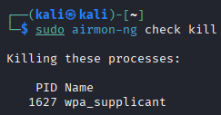
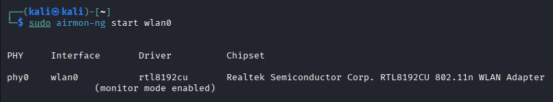
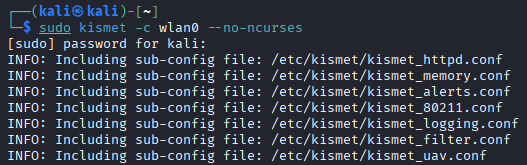
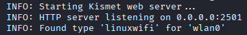
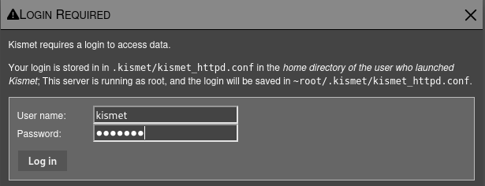
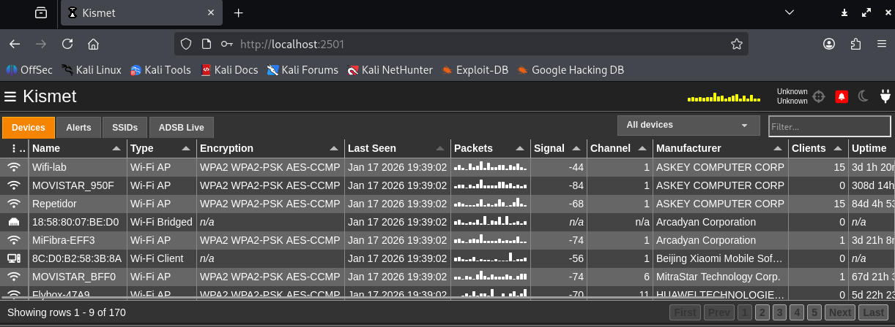

# Monitorización pasiva de redes WiFi con Kismet

Laboratorio de configuración de **Kismet** en Kali Linux para detectar, identificar y analizar de forma pasiva las redes WiFi y dispositivos del espectro 2.4/5 GHz, sin asociarse a ningún punto de acceso.

> Requiere un sistema con entorno gráfico funcional y una interfaz inalámbrica compatible con modo monitor.

## Índice

1. [Estructura del repositorio](#estructura-del-repositorio)
2. [Requisitos](#requisitos)
3. [Instalación de Kismet](#1-instalación-de-kismet)
4. [Interfaz en modo monitor](#2-interfaz-en-modo-monitor)
5. [Configuración de Kismet](#3-configuración-de-kismet)
6. [Inicio de Kismet y acceso web](#4-inicio-de-kismet-y-acceso-web)
7. [Notas y próximos pasos](#notas-y-próximos-pasos)

## Estructura del repositorio

```
kismet-wifi-monitoring/
├── README.md
├── screenshots/              # Capturas de verificación del proceso
└── scripts/
    ├── 01-instalacion-kismet.sh
    ├── 02-modo-monitor-wifi.sh
    ├── 03-iniciar-kismet.sh
    ├── setup-completo.sh
    └── config/
        └── kismet_site.conf.snippet
```

## Requisitos

- Kali Linux con entorno gráfico (para acceder a la interfaz web de Kismet).
- Adaptador WiFi compatible con modo monitor (en este laboratorio: chipset Realtek RTL8192CU).
- Permisos de `sudo`.

## 1. Instalación de Kismet

Script: [`scripts/01-instalacion-kismet.sh`](scripts/01-instalacion-kismet.sh)

```bash
sudo apt update && sudo apt install kismet kismet-plugins aircrack-ng gpsd -y
```

Para poder ejecutar Kismet sin privilegios de root en cada captura, se añade el usuario actual al grupo `kismet`:

```bash
sudo usermod -a -G kismet $USER
```

| Parámetro | Significado |
|---|---|
| `usermod` | Modifica un usuario existente |
| `-a` | Añade el grupo sin eliminar los que ya tenía |
| `-G kismet` | Grupo al que se añade |
| `$USER` | Usuario actual |

Tras esto es necesario abrir una nueva sesión de terminal (o ejecutar `newgrp kismet`) para que el cambio de grupo tenga efecto.

## 2. Interfaz en modo monitor

Script: [`scripts/02-modo-monitor-wifi.sh`](scripts/02-modo-monitor-wifi.sh)

Primero se comprueba que el adaptador WiFi está reconocido por el sistema:

```bash
lsusb
```



Se eliminan los procesos que puedan interferir con el modo monitor:

```bash
sudo airmon-ng check kill
```



Y se activa el modo monitor en la interfaz:

```bash
sudo airmon-ng start wlan0
```



## 3. Configuración de Kismet

Fichero: [`scripts/config/kismet_site.conf.snippet`](scripts/config/kismet_site.conf.snippet)

Ajustes aplicados sobre la configuración por defecto de Kismet:

- **`allowplugins=false`** — desactiva la carga de plugins (en este entorno fallaban al cargar).
- **`server_announce=false`** — evita que el servidor se anuncie por broadcast al exterior; queda accesible solo en `localhost`.
- **`remote_capture_listen=127.0.0.1`** — restringe la captura remota al loopback local.
- **`logprefix`** — ruta donde se almacenan los logs de capturas.
- **`source=wlan0`** — interfaz en modo monitor usada como fuente de captura.
- **`httpd_username` / `httpd_password`** — credenciales de acceso a la interfaz web.

> Cambia `httpd_password` por una contraseña propia antes de desplegar este laboratorio; el valor del fichero es solo un ejemplo de plantilla.

## 4. Inicio de Kismet y acceso web

Script: [`scripts/03-iniciar-kismet.sh`](scripts/03-iniciar-kismet.sh)

```bash
sudo kismet -c wlan0 --no-ncurses
```



El servidor web queda escuchando en el puerto 2501:



Accediendo desde el navegador a `http://localhost:2501/` se solicitan las credenciales configuradas en el paso anterior:



Tras iniciar sesión, el dashboard muestra en tiempo real los dispositivos y redes detectados (nombre, tipo, cifrado, señal, canal, fabricante, clientes asociados, etc.):



El dashboard se organiza en: panel superior de navegación, columna izquierda con los dispositivos detectados (MAC y detalles de conexión), panel central con el mapa de topología de red, barra derecha con estadísticas de redes/dispositivos/paquetes, y barra inferior con el estado operativo del sistema. La interfaz se actualiza dinámicamente a medida que se detectan nuevos dispositivos.

## Notas y próximos pasos

- Kismet alcanza un nivel de detección básico comparable a Wireshark, tcpdump o airodump-ng, aunque su configuración inicial resulta algo más tediosa.
- Quedan pendientes de implementar: alertas en tiempo real y una configuración avanzada de logging, lo que permitiría transformar este sistema de monitoreo pasivo en una herramienta proactiva de seguridad.

---

## Uso rápido

```bash
git clone <url-de-este-repositorio>
cd kismet-wifi-monitoring/scripts
chmod +x *.sh
./setup-completo.sh
```

Ajusta el nombre de la interfaz (`wlan0`) y las credenciales del fichero de configuración antes de ejecutar en tu propio entorno.
