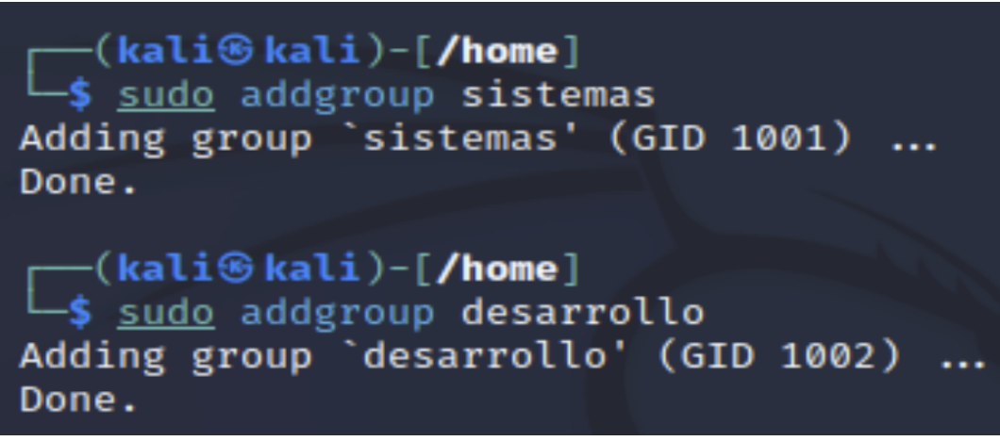
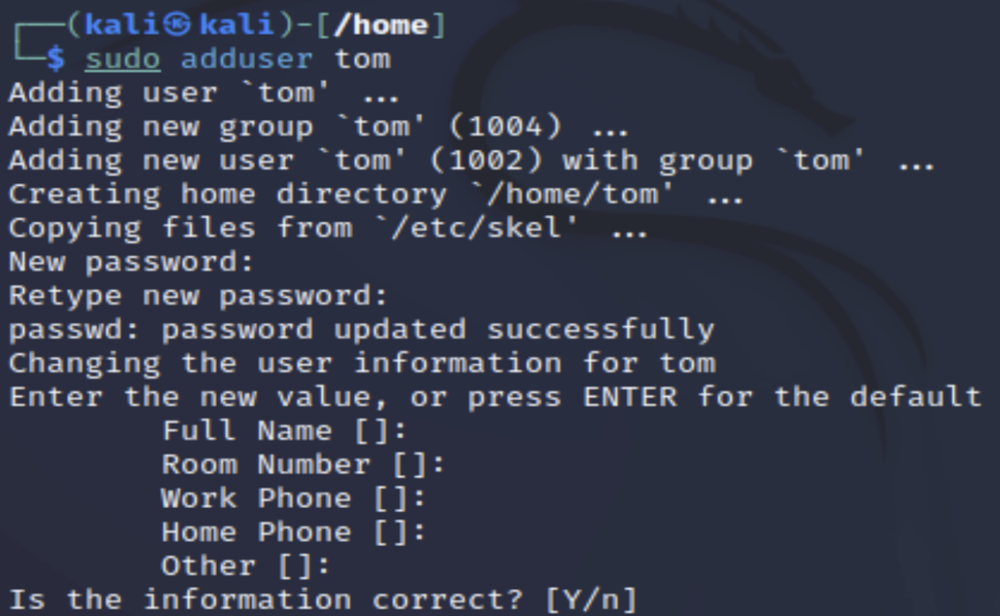
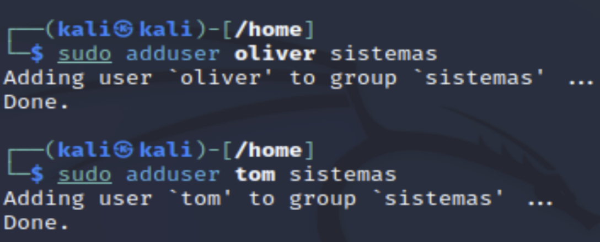
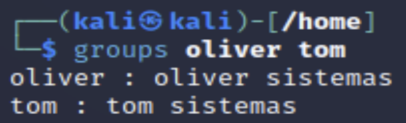
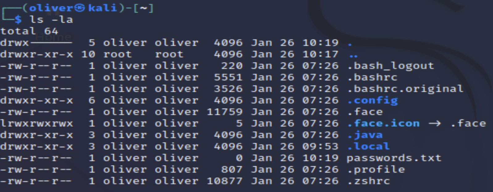
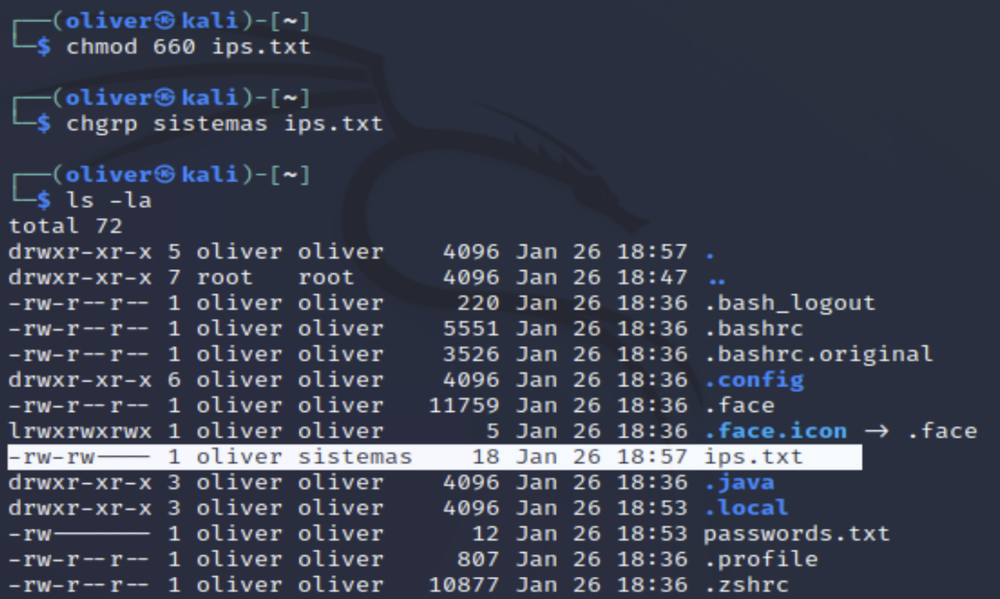
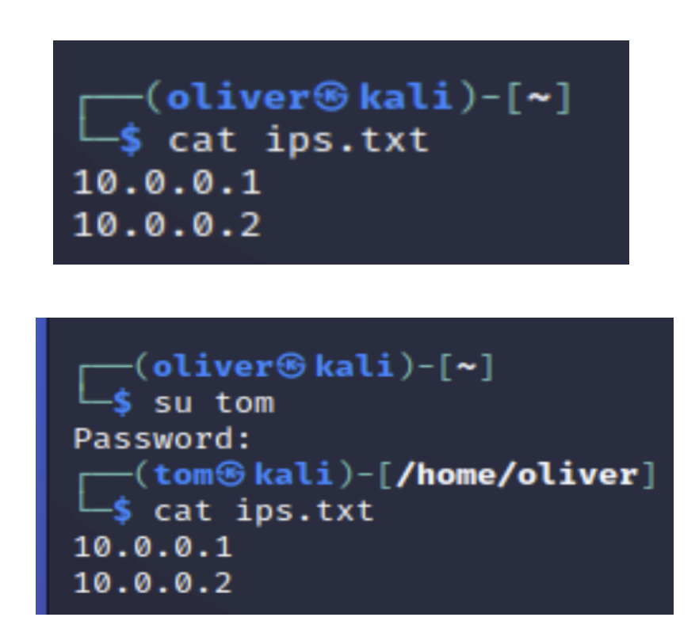
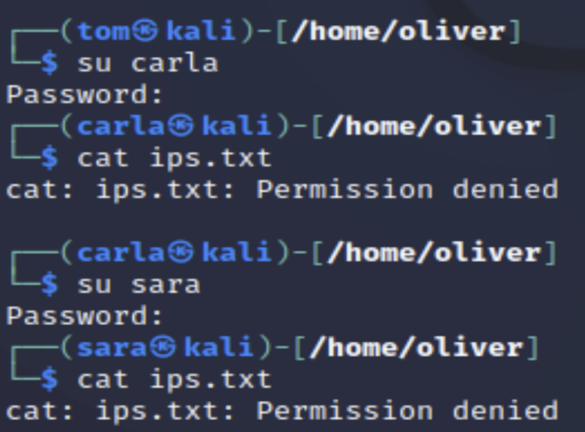
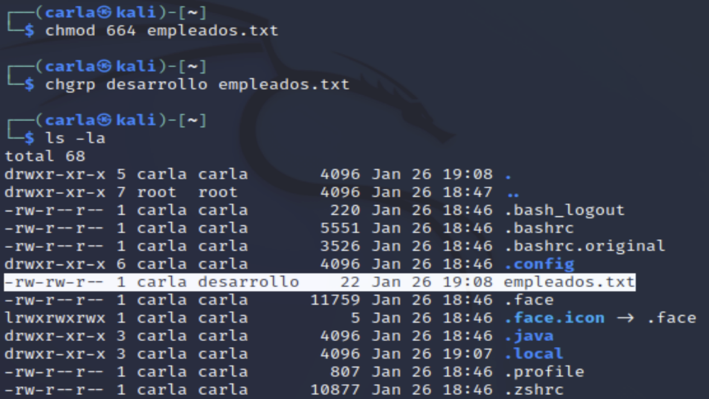
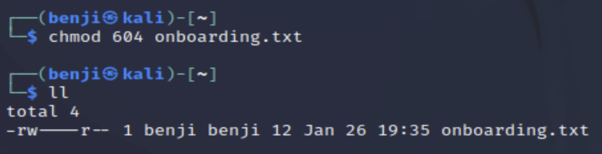

# Gestión de Usuarios, Grupos y Permisos en Linux

Ejercicio práctico de administración de usuarios y permisos en **Kali Linux**: creación de grupos y usuarios, y control de acceso a ficheros mediante `chmod`/`chgrp` mediante distintos escenarios reales (ficheros privados, compartidos por departamento, o restringidos a un grupo concreto).

## Índice

1. [Estructura del repositorio](#estructura-del-repositorio)
2. [Requisitos](#requisitos)
3. [Grupos y usuarios base](#1-grupos-y-usuarios-base)
4. [Fichero privado: passwords.txt](#2-fichero-privado-passwordstxt)
5. [Fichero compartido por grupo: ips.txt](#3-fichero-compartido-por-grupo-ipstxt)
6. [Lectura pública / escritura de grupo: empleados.txt](#4-lectura-pública--escritura-de-grupo-empleadostxt)
7. [Grupo rrhh y traspaso de propiedad](#5-grupo-rrhh-y-traspaso-de-propiedad)
8. [Usuario Benji y onboarding.txt](#6-usuario-benji-y-onboardingtxt)
9. [Grupo seguridad: vulnerabilidades.txt](#7-grupo-seguridad-vulnerabilidadestxt)
10. [Grupo normativa: normativa.txt](#8-grupo-normativa-normativatxt)
11. [Resumen de permisos](#resumen-de-permisos)

## Estructura del repositorio

```
linux-users-groups-permissions/
├── README.md
├── screenshots/              # Capturas de verificación del ejercicio
└── scripts/                  # Scripts numerados con todos los comandos
    ├── 01-crear-grupos.sh
    ├── 02-crear-usuarios-sistemas.sh
    ├── 03-crear-usuarios-desarrollo.sh
    ├── 04-passwords-privado.sh
    ├── 05-ips-grupo-sistemas.sh
    ├── 06-empleados-grupo-desarrollo.sh
    ├── 07-grupo-rrhh.sh
    ├── 08-benji-onboarding.sh
    ├── 09-grupo-seguridad.sh
    ├── 10-grupo-normativa.sh
    └── setup-completo.sh      # Orquesta los pasos 1-3 y guía el resto
```

## Requisitos

- Kali Linux (o cualquier distribución basada en Debian).
- Permisos de `sudo`.
- Conocimientos básicos de `su` para cambiar de usuario y probar permisos.

## 1. Grupos y usuarios base

Script: [`scripts/01-crear-grupos.sh`](scripts/01-crear-grupos.sh) · [`02-crear-usuarios-sistemas.sh`](scripts/02-crear-usuarios-sistemas.sh) · [`03-crear-usuarios-desarrollo.sh`](scripts/03-crear-usuarios-desarrollo.sh)

Se crean dos grupos, **sistemas** y **desarrollo**, y cuatro usuarios:

- **Oliver** y **Tom** → únicamente en el grupo `sistemas`.
- **Carla** y **Sara** → únicamente en el grupo `desarrollo`.



`adduser` crea además el home y solicita contraseña e información opcional del usuario:



Tras crear cada usuario, se le asigna su grupo correspondiente con `adduser <usuario> <grupo>`:



Y se verifica la pertenencia con `groups`:



## 2. Fichero privado: passwords.txt

Script: [`scripts/04-passwords-privado.sh`](scripts/04-passwords-privado.sh)

Oliver crea `passwords.txt` en su propio home. Por defecto, `touch` asigna permisos `644` (lectura para todos):



Para que solo Oliver pueda leerlo y escribirlo, se restringe con:

```bash
chmod 600 passwords.txt
```

Con `600` (`rw-------`), ni siquiera el grupo ni el resto de usuarios tienen ningún permiso; al intentar `tom` leer el fichero, el sistema responde con `Permission denied`.

## 3. Fichero compartido por grupo: ips.txt

Script: [`scripts/05-ips-grupo-sistemas.sh`](scripts/05-ips-grupo-sistemas.sh)

Oliver crea `ips.txt` y lo comparte con todo el grupo `sistemas` (él mismo y Tom), cambiando el grupo propietario y dando permisos de lectura/escritura al grupo:

```bash
chgrp sistemas ips.txt
chmod 660 ips.txt
```



Tanto Oliver como Tom (grupo `sistemas`) pueden leer el contenido sin problema:



Mientras que Carla y Sara (grupo `desarrollo`) no tienen ningún permiso sobre el fichero:



## 4. Lectura pública / escritura de grupo: empleados.txt

Script: [`scripts/06-empleados-grupo-desarrollo.sh`](scripts/06-empleados-grupo-desarrollo.sh)

Carla crea `empleados.txt`, pensado para que **cualquier usuario** pueda leerlo, pero solo los miembros del grupo `desarrollo` (Carla y Sara) puedan modificarlo:

```bash
chmod 664 empleados.txt
chgrp desarrollo empleados.txt
```



Con `664` (`rw-rw-r--`), Carla y Sara pueden editar el fichero; Tom y Oliver, al no pertenecer al grupo, solo pueden leerlo.

## 5. Grupo rrhh y traspaso de propiedad

Script: [`scripts/07-grupo-rrhh.sh`](scripts/07-grupo-rrhh.sh)

Se crea el grupo `rrhh` y la usuaria **Pepa**, que se incorpora a dicho grupo:


El fichero `empleados.txt` cambia de grupo propietario, pasando de `desarrollo` a `rrhh`:

```bash
sudo chgrp rrhh empleados.txt
```

## 6. Usuario Benji y onboarding.txt

Script: [`scripts/08-benji-onboarding.sh`](scripts/08-benji-onboarding.sh)

Se crea el usuario **Benji**, también en el grupo `rrhh`, y dentro de su home se crea `onboarding.txt` con lectura para el resto de usuarios pero sin permiso de escritura para nadie salvo Benji:

```bash
chmod 604 onboarding.txt
```



Con `604` (`rw----r--`), el resto de usuarios puede leer el fichero pero ninguno (ni siquiera el grupo `benji`) puede modificarlo.

## 7. Grupo seguridad: vulnerabilidades.txt

Script: [`scripts/09-grupo-seguridad.sh`](scripts/09-grupo-seguridad.sh)

Se crea el grupo `seguridad`, con **Sara** como única integrante, y el fichero `vulnerabilidades.txt` en su home:

```bash
chgrp seguridad vulnerabilidades.txt
chmod 660 vulnerabilidades.txt
```

Al ser Sara la única miembro del grupo `seguridad`, el permiso `660` (`rw-rw----`) deja el fichero accesible únicamente para ella; el resto de usuarios (Carla, Oliver, Pepa, Tom) recibe `Permission denied`.

## 8. Grupo normativa: normativa.txt

Script: [`scripts/10-grupo-normativa.sh`](scripts/10-grupo-normativa.sh)

Se crea el grupo `normativa`, compartido por **Tom** y **Sara**, y el fichero `normativa.txt` en el home de Sara:

```bash
chgrp normativa normativa.txt
chmod 660 normativa.txt
```

Con `660`, Sara (propietaria) y Tom (grupo `normativa`) tienen lectura y escritura; el resto de usuarios no tiene ningún acceso.

> **Nota de corrección:** en los apuntes originales del ejercicio el orden de los usuarios en `adduser` aparecía invertido (`adduser normativa tom`). La sintaxis correcta de `adduser` es `adduser <usuario> <grupo>`, por lo que en este repositorio se ha corregido a `adduser tom normativa` / `adduser sara normativa`.

## Resumen de permisos

| Fichero | Propietario | Grupo | Permisos | Quién puede leer | Quién puede escribir |
|---|---|---|---|---|---|
| `passwords.txt` | oliver | oliver | `600` | oliver | oliver |
| `ips.txt` | oliver | sistemas | `660` | oliver, tom | oliver, tom |
| `empleados.txt` | carla | rrhh *(antes desarrollo)* | `664` | todos | carla, sara *(mientras el grupo fue desarrollo)* |
| `onboarding.txt` | benji | benji | `604` | todos | benji |
| `vulnerabilidades.txt` | sara | seguridad | `660` | sara | sara |
| `normativa.txt` | sara | normativa | `660` | sara, tom | sara, tom |

---

## Uso rápido

```bash
git clone <url-de-este-repositorio>
cd linux-users-groups-permissions/scripts
chmod +x *.sh
./setup-completo.sh
```

Los scripts `04` a `10` crean ficheros dentro del home de un usuario concreto: ejecútalos tras cambiar de usuario con `su <usuario>`, o adapta las rutas según tu entorno.
