# 🛡️ Reporte de Vulnerabilidades Nessus — Blue Team
**Autor:** José López | **Entorno:** Laboratorio aislado (NAT)
**Máquinas analizadas:** Windowsploitable 7 · Metasploitable 2 · Metasploitable 3

---

## 📋 Índice

1. [¿Qué es Nessus?](#1-qué-es-nessus)
2. [Instalación y arranque en Linux / Kali](#2-instalación-y-arranque-en-linux--kali)
3. [Resumen ejecutivo](#3-resumen-ejecutivo)
4. [Windowsploitable 7](#4-windowsploitable-7)
5. [Metasploitable 2](#5-metasploitable-2)
6. [Metasploitable 3](#6-metasploitable-3)
7. [Resumen global de vulnerabilidades](#7-resumen-global-de-vulnerabilidades)
8. [Plan de remediación por prioridad](#8-plan-de-remediación-por-prioridad)
9. [Capturas del escaneo original](#9-capturas-del-escaneo-original)

---

## 1. ¿Qué es Nessus?

**Nessus** es el escáner de vulnerabilidades más utilizado en el mundo, desarrollado por [Tenable](https://www.tenable.com). Analiza hosts de red para identificar:

- Vulnerabilidades conocidas (CVEs)
- Configuraciones inseguras
- Servicios con versiones desactualizadas
- Credenciales por defecto
- Parches de seguridad ausentes

Dispone de una base de datos con más de **210.000 plugins** que cubren más de **85.000 vulnerabilidades únicas**, actualizada continuamente. Nessus clasifica las vulnerabilidades por severidad: **Crítica · Alta · Media · Baja · Informativa**.

### Interfaz de Nessus — Dashboard principal


*Panel principal accesible en `https://localhost:8834` tras arrancar el servicio*

### Ejemplo de resultados con vulnerabilidades críticas


*Vista de vulnerabilidades agrupadas por severidad tras completar un escaneo*

---

## 2. Instalación y arranque en Linux / Kali

### Paso 1 — Descargar el paquete

Descarga el instalador desde la página oficial seleccionando tu distribución:

```
https://www.tenable.com/downloads/nessus
```

Para **Kali Linux / Debian / Ubuntu** descarga el archivo `.deb` (64-bit amd64).

### Paso 2 — Instalar Nessus

```bash
# Debian / Kali / Ubuntu
sudo dpkg -i Nessus-10.x.x-debian10_amd64.deb

# Red Hat / CentOS / Fedora
sudo dnf install Nessus-10.x.x-el8.x86_64.rpm

# SUSE
sudo zypper install Nessus-10.x.x-suse12.x86_64.rpm
```

### Paso 3 — Gestión del servicio

```bash
# Iniciar Nessus (Kali / Debian / Ubuntu)
sudo systemctl start nessusd

# Parar Nessus
sudo systemctl stop nessusd

# Reiniciar Nessus
sudo systemctl restart nessusd

# Ver el estado del servicio
sudo systemctl status nessusd

# Habilitar inicio automático con el sistema
sudo systemctl enable nessusd

# Red Hat / CentOS / Fedora / SUSE / FreeBSD (alternativa)
sudo service nessusd start
```

### Paso 4 — Acceder a la interfaz web

```bash
# Acceso local
https://localhost:8834

# Acceso remoto (sustituye por la IP de tu máquina Kali)
https://192.168.1.X:8834
```

> ⚠️ El navegador mostrará un aviso de certificado SSL no confiable. Es normal — haz clic en **Avanzado → Continuar de todas formas**.

### Paso 5 — Configuración inicial (primera vez)

1. Selecciona el tipo: **Nessus Essentials** (gratuito, hasta 16 IPs) o **Nessus Professional**
2. Crea una cuenta de administrador local
3. Introduce tu código de activación (obtenerlo en `https://www.tenable.com/products/nessus/activation-code`)
4. Espera a que descargue y compile los plugins — la primera vez puede tardar **15-30 minutos**

### Comandos útiles adicionales

```bash
# Ver logs en tiempo real
sudo tail -f /opt/nessus/var/nessus/logs/nessusd.messages

# Ver la versión instalada
/opt/nessus/sbin/nessuscli -v

# Actualizar plugins manualmente
sudo /opt/nessus/sbin/nessuscli update --all

# Crear usuario administrador desde CLI (si no puedes acceder a la web)
sudo /opt/nessus/sbin/nessuscli adduser

# Verificar que el puerto 8834 está escuchando
sudo ss -tlnp | grep 8834
```

### Flujo de trabajo básico en Nessus

```
1. Acceder → https://localhost:8834
2. New Scan → seleccionar plantilla (Basic Network Scan)
3. Configurar → nombre del escaneo + IPs objetivo
4. Launch → iniciar el escaneo
5. Esperar resultados → ver en la pestaña Scans
6. Exportar informe → Export → PDF / CSV / HTML
```

---

## 3. Resumen ejecutivo

| Máquina | SO | Vulns Críticas | Riesgo Global |
|---|---|---|---|
| **Windowsploitable 7** | Windows 7 SP1 | 3 | 🔴 CRÍTICO |
| **Metasploitable 2** | Linux (Ubuntu 8.04) | 3 | 🔴 CRÍTICO |
| **Metasploitable 3** | Ubuntu 14.04 LTS | 3 | 🔴 CRÍTICO |

Las tres máquinas presentan vulnerabilidades críticas con **ejecución remota de código sin autenticación**. La acción inmediata es aislarlas en una VLAN sin acceso externo hasta aplicar los parches correspondientes.

---

## 4. Windowsploitable 7

**Sistema:** Windows 7 Professional SP1

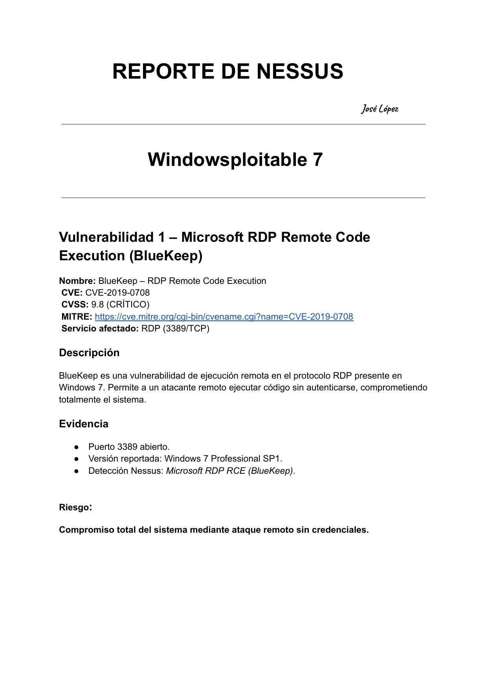

---

### 🔴 Vuln 1 — CVE-2019-0708 — BlueKeep (RDP RCE)

| CVE | CVSS | Puerto | Auth requerida | Wormable |
|---|---|---|---|---|
| [CVE-2019-0708](https://cve.mitre.org/cgi-bin/cvename.cgi?name=CVE-2019-0708) | **9.8** 🔴 | 3389/TCP | ❌ Ninguna | ✅ Sí |

**¿Qué es?** BlueKeep es un fallo en el protocolo RDP de Windows 7 que permite ejecutar código arbitrario de forma remota sin ninguna credencial. Es *wormable*: puede propagarse automáticamente de máquina en máquina como WannaCry.

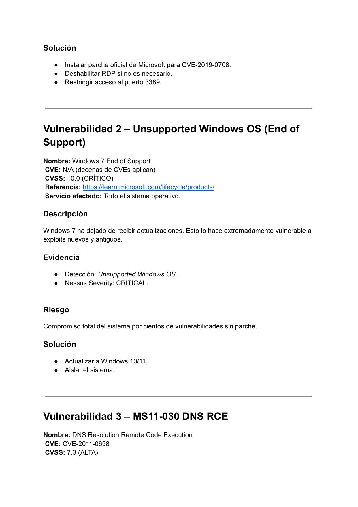

**Evidencia Nessus:** Puerto 3389/TCP abierto · Windows 7 Professional SP1 · Plugin: *Microsoft RDP RCE (BlueKeep)*

**Remediación:**
```powershell
# Instalar parche KB4499175
# https://support.microsoft.com/kb/4499175

# Deshabilitar RDP si no es necesario
Set-ItemProperty -Path "HKLM:\System\CurrentControlSet\Control\Terminal Server" `
  -Name "fDenyTSConnections" -Value 1

# Habilitar Network Level Authentication (NLA)
Set-ItemProperty -Path "HKLM:\System\CurrentControlSet\Control\Terminal Server\WinStations\RDP-Tcp" `
  -Name "UserAuthentication" -Value 1

# Bloquear puerto 3389 en el firewall de Windows
netsh advfirewall firewall add rule name="Block RDP" `
  protocol=TCP dir=in localport=3389 action=block
```

---

### 🔴 Vuln 2 — End of Support — Windows 7

| Fin de soporte | CVE | CVSS |
|---|---|---|
| 14 enero 2020 | N/A (cientos de CVEs sin parche) | **10.0** 🔴 |

**¿Qué es?** Windows 7 no recibe actualizaciones desde enero de 2020. Cualquier vulnerabilidad nueva queda permanentemente sin corregir: kernel, RDP, SMB, DNS client, librerías del sistema...

**Mención especial — EternalBlue (MS17-010):**

| CVE | CVSS | VPR Score | Exploits conocidos |
|---|---|---|---|
| CVE-2017-0144 | 8.1 | **9.8** | EternalBlue, WannaCry, NotPetya, EternalRomance, EternalChampion, EternalSynergy, Petya |

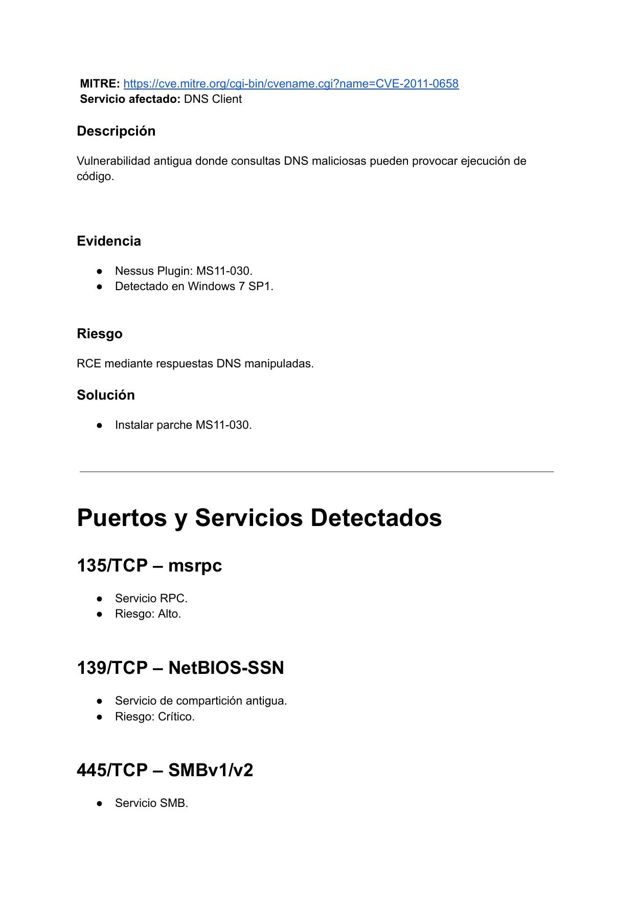

**Remediación:**
```powershell
# Acción principal: actualizar a Windows 10/11

# Mientras tanto — deshabilitar SMBv1 (URGENTE)
Set-SmbServerConfiguration -EnableSMB1Protocol $false

# Verificar
Get-SmbServerConfiguration | Select EnableSMB1Protocol
```

---

### 🟠 Vuln 3 — CVE-2011-0658 — MS11-030 DNS RCE

| CVE | CVSS | Servicio |
|---|---|---|
| [CVE-2011-0658](https://cve.mitre.org/cgi-bin/cvename.cgi?name=CVE-2011-0658) | **7.3** 🟠 | DNS Client |

**¿Qué es?** Fallo en el cliente DNS de Windows que permite RCE mediante respuestas DNS maliciosas manipuladas por un atacante en posición de MITM o con control del servidor DNS.

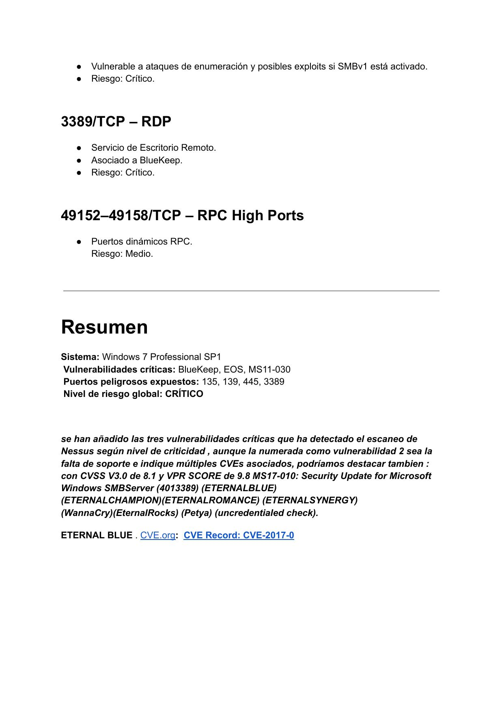

**Remediación:** Instalar parche MS11-030 desde Windows Update.

---

### Puertos y servicios — Windowsploitable 7

| Puerto | Servicio | Riesgo | Acción recomendada |
|---|---|---|---|
| 135/TCP | MSRPC | 🟠 Alto | Restringir con firewall |
| 139/TCP | NetBIOS-SSN | 🔴 Crítico | Deshabilitar si no se usa |
| 445/TCP | SMBv1/v2 | 🔴 Crítico | Deshabilitar SMBv1 inmediatamente |
| 3389/TCP | RDP — BlueKeep | 🔴 Crítico | Deshabilitar o NLA + restricción por IP |
| 49152-49158/TCP | RPC High Ports | 🟡 Medio | Limitar con firewall perimetral |

---

## 5. Metasploitable 2

**Sistema:** Linux (basado en Ubuntu 8.04)

---

### 🔴 Vuln 1 — CVE-2011-2523 — VSFTPD 2.3.4 Backdoor

| CVE | CVSS | Puerto | ExploitDB |
|---|---|---|---|
| [CVE-2011-2523](https://cve.mitre.org/cgi-bin/cvename.cgi?name=CVE-2011-2523) | **10.0** 🔴 | 21/TCP | [#49757](https://www.exploit-db.com/exploits/49757) |

**¿Qué es?** VSFTPD 2.3.4 fue distribuido con una puerta trasera: si el nombre de usuario contiene `:)`, el servidor abre una shell con privilegios root en el puerto 6200 sin contraseña.

```
Trigger: usuario → user:)  →  shell root en puerto 6200
```

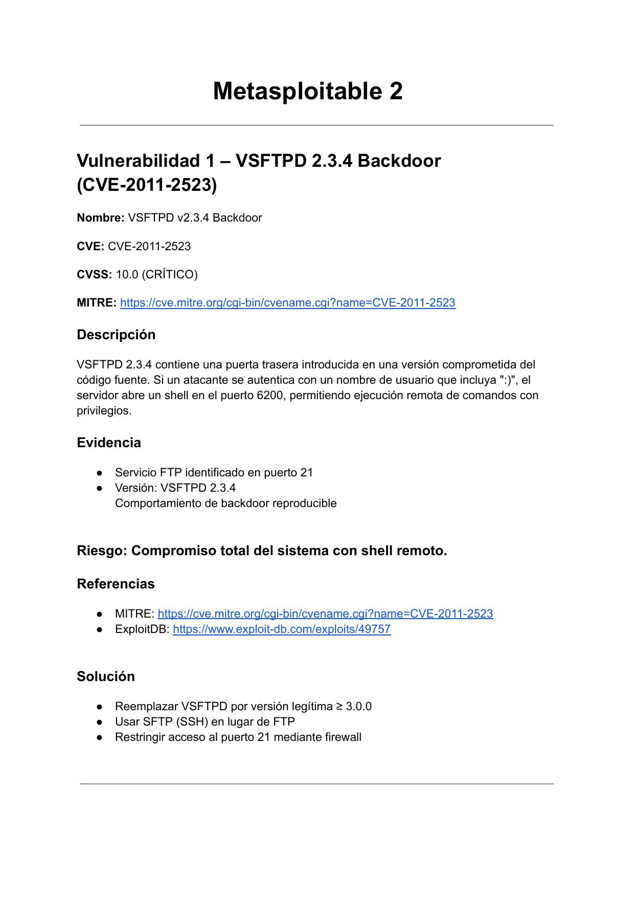

**Remediación:**
```bash
# Parar el servicio inmediatamente
sudo systemctl stop vsftpd
sudo ufw deny 21/tcp
sudo ufw deny 6200/tcp

# Desinstalar y reinstalar versión limpia >= 3.0.0
sudo apt-get remove vsftpd
sudo apt-get install vsftpd

# Alternativa recomendada: migrar a SFTP
sudo nano /etc/ssh/sshd_config
# Añadir: Subsystem sftp /usr/lib/openssh/sftp-server
sudo systemctl restart ssh
```

---

### 🔴 Vuln 2 — Tomcat Manager — Credenciales por defecto

| CWE | CVSS | Puerto |
|---|---|---|
| [CWE-521](https://cwe.mitre.org/data/definitions/521.html) | **9.8** 🔴 | 8180/TCP |

**¿Qué es?** Tomcat está configurado con `tomcat:tomcat` y `admin:admin`. El Manager permite desplegar archivos WAR — un atacante puede subir una webshell y obtener RCE completo.

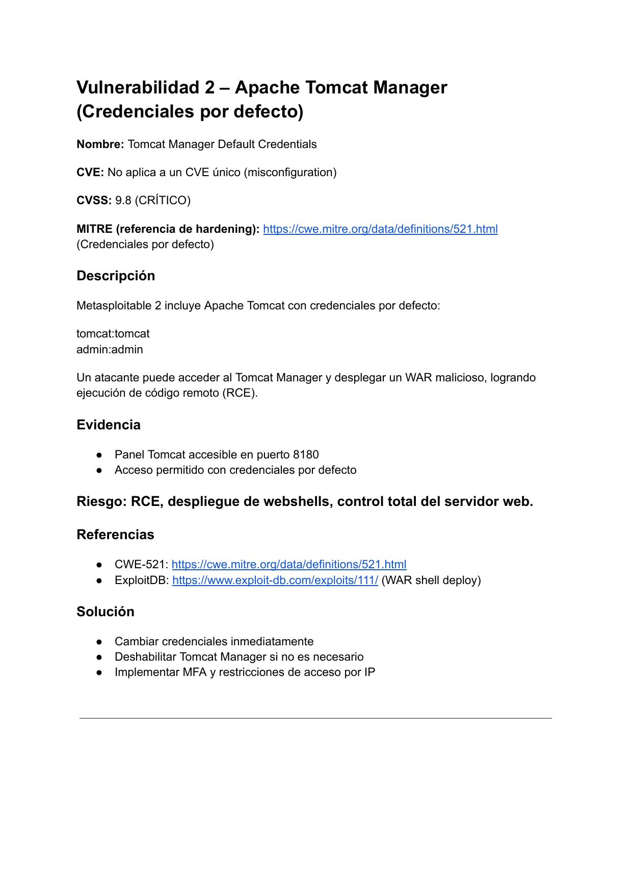

**Remediación:**
```bash
# Cambiar credenciales en tomcat-users.xml
sudo nano /etc/tomcat/tomcat-users.xml
# <user username="admin" password="CONTRASEÑA_FUERTE" roles="manager-gui"/>

# O deshabilitar el Manager directamente
sudo rm -rf /var/lib/tomcat/webapps/manager
sudo systemctl restart tomcat
```

---

### 🔴 Vuln 3 — CVE-2003-0201 — Samba trans2open

| CVE | CVSS | Puertos | ExploitDB |
|---|---|---|---|
| [CVE-2003-0201](https://cve.mitre.org/cgi-bin/cvename.cgi?name=CVE-2003-0201) | **10.0** 🔴 | 139/445 TCP | [#23674](https://www.exploit-db.com/exploits/23674) |

**¿Qué es?** Samba 3.0.20 tiene un desbordamiento de búfer en `trans2open`. Una petición SMB malformada permite obtener shell como root sin autenticación.

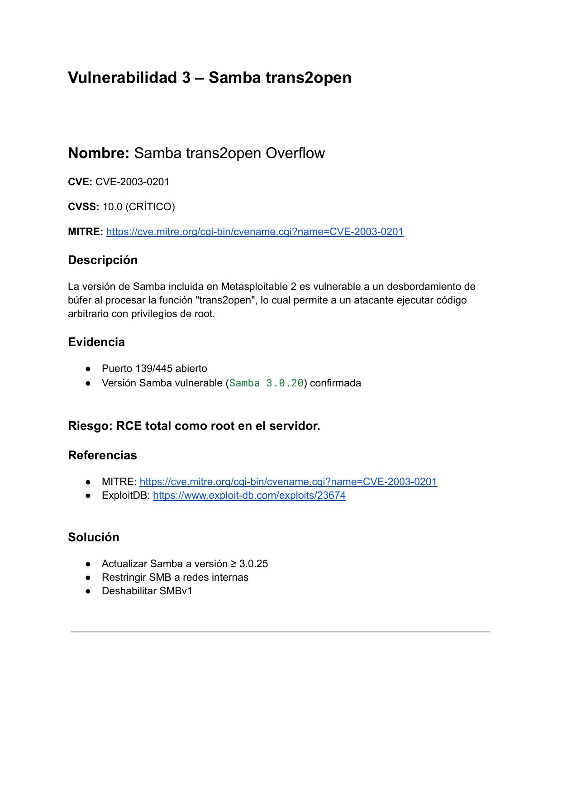

**Remediación:**
```bash
sudo apt-get update && sudo apt-get install samba

# Deshabilitar SMBv1 en /etc/samba/smb.conf → [global]:
#   min protocol = SMB2

sudo ufw deny 139/tcp
sudo ufw deny 445/tcp
sudo systemctl restart smbd
```

---

### Puertos y servicios — Metasploitable 2

| Puerto | Servicio | Versión | Riesgo | Notas |
|---|---|---|---|---|
| 21/TCP | FTP | VSFTPD 2.3.4 | 🔴 Crítico | Backdoor — shell en :6200 |
| 22/TCP | SSH | OpenSSH 4.7p1 | 🟡 Medio | Versión antigua, fuerza bruta posible |
| 23/TCP | Telnet | — | 🟠 Alto | Sin cifrado, credenciales por defecto |
| 139/TCP | NetBIOS/SMB | Samba 3.0.20 | 🔴 Crítico | CVE-2003-0201 |
| 445/TCP | SMB | Samba 3.0.20 | 🔴 Crítico | CVE-2003-0201 |
| 8180/TCP | HTTP | Tomcat | 🔴 Crítico | Credenciales por defecto |

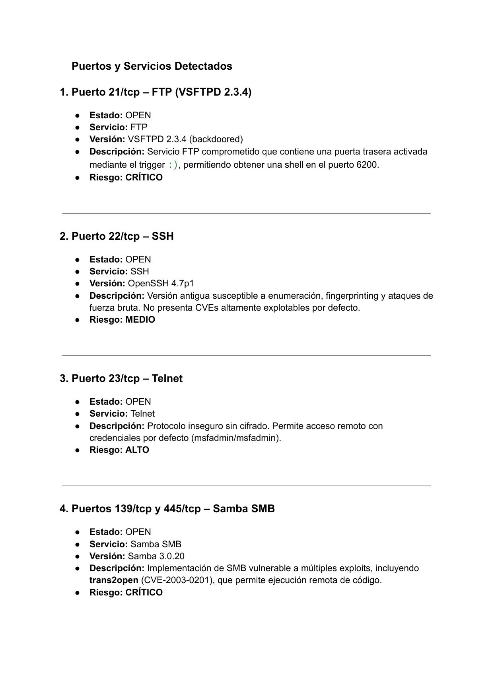

---

## 6. Metasploitable 3

**Sistema:** Ubuntu 14.04 LTS

---

### 🔴 Vuln 1 — CVE-2015-3306 — ProFTPD mod_copy

| CVE | CVSS | Plugin Nessus | ExploitDB |
|---|---|---|---|
| [CVE-2015-3306](https://cve.mitre.org/cgi-bin/cvename.cgi?name=CVE-2015-3306) | **9.8** 🔴 | 939384215 | [#36803](https://www.exploit-db.com/exploits/36803) |

**¿Qué es?** El módulo `mod_copy` de ProFTPD permite copiar archivos del servidor sin autenticación con los comandos `SITE CPFR` y `SITE CPTO`. Un atacante puede leer `/etc/passwd`, claves SSH o depositar una webshell.

```bash
# Ejemplo de ataque sin autenticación
SITE CPFR /etc/passwd
SITE CPTO /var/www/html/passwd.txt
# → http://victima/passwd.txt ahora es público
```

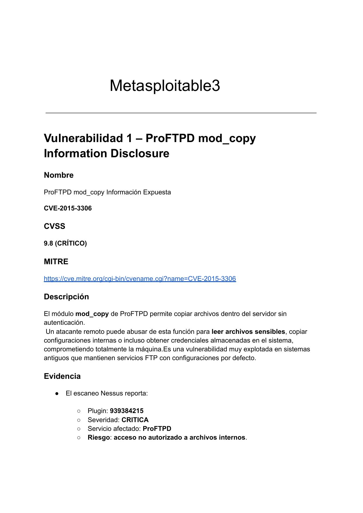

**Remediación:**
```bash
sudo apt-get update && sudo apt-get install proftpd

# Deshabilitar mod_copy en /etc/proftpd/proftpd.conf:
# (comentar) # LoadModule mod_copy.c

sudo ufw deny 21/tcp
sudo systemctl restart proftpd
```

---

### 🔴 Vuln 2 — Ubuntu 14.04 End of Life

| Fin de soporte | CVSS | Plugin Nessus |
|---|---|---|
| Abril 2019 | **10.0** 🔴 | 201408 |

**¿Qué es?** Ubuntu 14.04 sin parches desde abril de 2019. Kernel, OpenSSL, Bash, Python, Apache, glibc — todos permanentemente vulnerables a CVEs nuevos y antiguos.

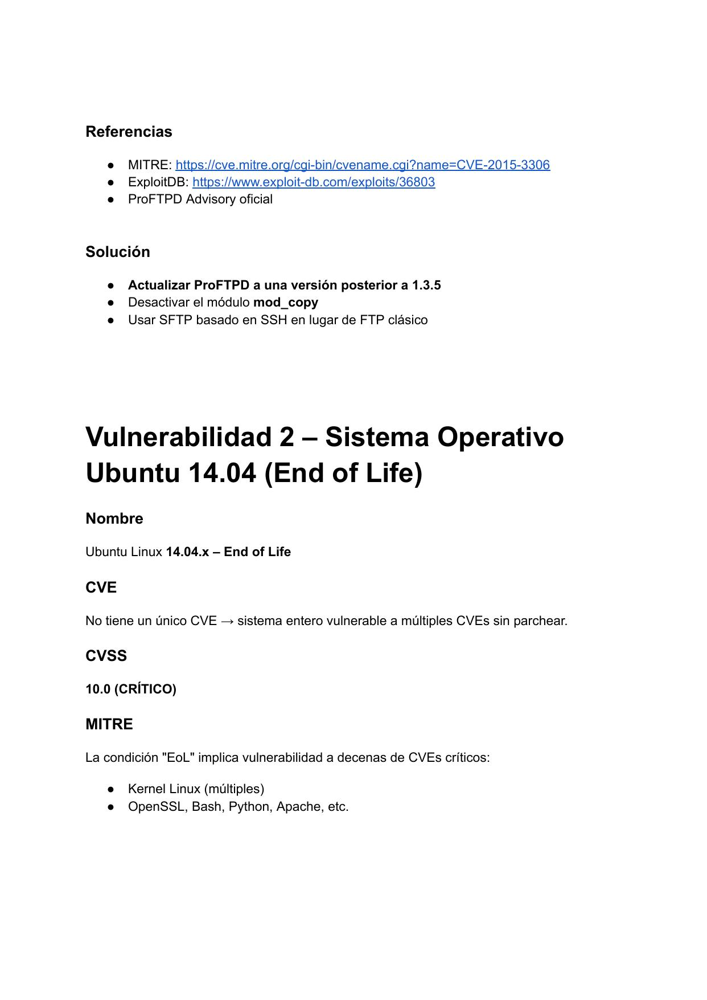

**Remediación:**
```bash
# Migrar a Ubuntu 22.04 LTS (soportado hasta 2027)
sudo do-release-upgrade

# Si no es posible migrar: activar Ubuntu Pro ESM
sudo pro attach <token>
sudo pro enable esm-infra
```

---

### 🔴 Vuln 3 — CVE-2014-3566 — POODLE / OpenSSL

| CVE | CVSS | Plugin Nessus |
|---|---|---|
| [CVE-2014-3566](https://cve.mitre.org/cgi-bin/cvename.cgi?name=CVE-2014-3566) | **10.0** 🔴 | 92626 |

**¿Qué es?** POODLE explota la negociación de SSLv3 (protocolo obsoleto de 1996). Un atacante MITM puede forzar un *downgrade* y descifrar las comunicaciones, robando cookies de sesión y credenciales.

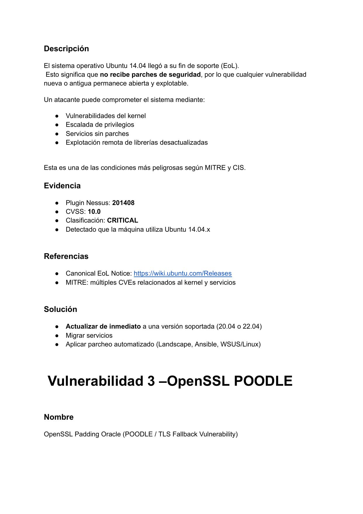

**Remediación:**
```bash
# Deshabilitar SSLv3 en Apache (/etc/apache2/mods-enabled/ssl.conf)
SSLProtocol all -SSLv2 -SSLv3
SSLCipherSuite ECDH+AESGCM:DH+AESGCM:ECDH+AES256:!aNULL:!MD5

# Deshabilitar SSLv3 en Nginx (/etc/nginx/nginx.conf)
ssl_protocols TLSv1.2 TLSv1.3;

# Actualizar OpenSSL
sudo apt-get update && sudo apt-get install openssl

# Verificar que SSLv3 está deshabilitado
openssl s_client -ssl3 -connect localhost:443
# Debe responder: "handshake failure"

sudo systemctl restart apache2
```

---

### Puertos y servicios — Metasploitable 3

| Puerto | Servicio | Versión | Riesgo | Notas |
|---|---|---|---|---|
| 111/TCP | rpcbind | RPC 2-4 | 🟠 Alto | Expone mapa de servicios RPC internos |
| 139/TCP | NetBIOS/SMB | Samba 3.x–4.x | 🔴 Crítico | Enumeración de usuarios y shares |
| 445/TCP | SMB | Samba 4.3.11 | 🔴 Crítico | Posible RCE sin parche |
| 631/TCP | CUPS | CUPS 1.7.2 | 🔴 Crítico | Método HTTP PUT habilitado — permite subir archivos arbitrarios |

```bash
# Deshabilitar método PUT en CUPS (/etc/cups/cupsd.conf)
# <Location /> → Deny from all
sudo systemctl restart cups
```

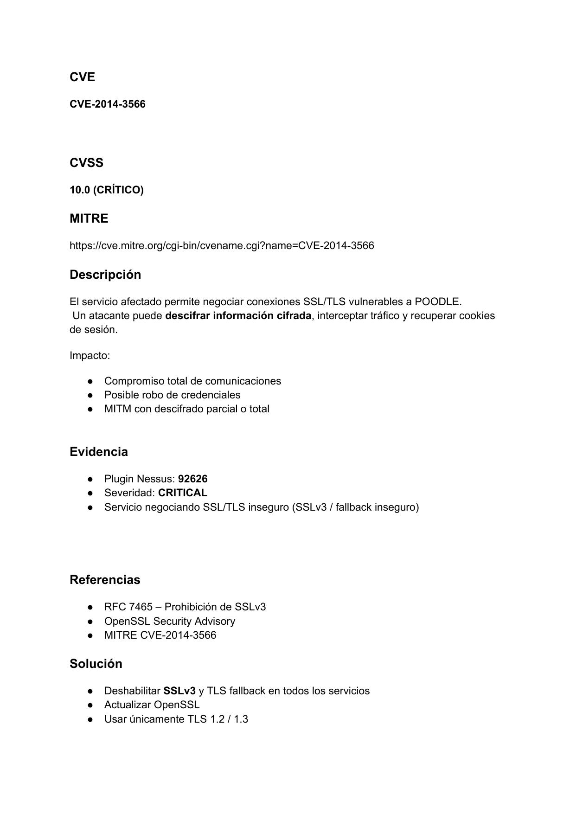

---

## 7. Resumen global de vulnerabilidades

| # | Máquina | Vulnerabilidad | CVE | CVSS | Impacto |
|---|---|---|---|---|---|
| 1 | Win7 | BlueKeep — RDP RCE | CVE-2019-0708 | **9.8** 🔴 | RCE sin auth, wormable |
| 2 | Win7 | Windows 7 End of Support | N/A | **10.0** 🔴 | Sin parches permanente |
| 3 | Win7 | EternalBlue — SMBv1 | CVE-2017-0144 | **8.1** 🟠 | RCE sin auth |
| 4 | Win7 | MS11-030 DNS RCE | CVE-2011-0658 | **7.3** 🟠 | RCE via DNS |
| 5 | Meta2 | VSFTPD 2.3.4 Backdoor | CVE-2011-2523 | **10.0** 🔴 | Shell root sin auth |
| 6 | Meta2 | Tomcat Credenciales defecto | CWE-521 | **9.8** 🔴 | RCE via WAR deploy |
| 7 | Meta2 | Samba trans2open | CVE-2003-0201 | **10.0** 🔴 | Buffer overflow RCE root |
| 8 | Meta3 | ProFTPD mod_copy | CVE-2015-3306 | **9.8** 🔴 | Lectura/escritura sin auth |
| 9 | Meta3 | Ubuntu 14.04 EoL | N/A | **10.0** 🔴 | Sin parches permanente |
| 10 | Meta3 | POODLE / SSLv3 | CVE-2014-3566 | **10.0** 🔴 | MITM y descifrado de tráfico |

---

## 8. Plan de remediación por prioridad

### 🔴 Prioridad 1 — Acción inmediata (hoy)

```bash
# WINDOWS 7
Set-SmbServerConfiguration -EnableSMB1Protocol $false           # Deshabilitar SMBv1
Set-ItemProperty ... -Name "fDenyTSConnections" -Value 1        # Deshabilitar RDP

# METASPLOITABLE 2
sudo systemctl stop vsftpd && sudo ufw deny 21/tcp              # Parar VSFTPD
sudo ufw deny 6200/tcp                                          # Bloquear backdoor
sudo systemctl stop tomcat                                      # Parar Tomcat
sudo ufw deny 139/tcp && sudo ufw deny 445/tcp                  # Bloquear SMB

# TODAS LAS MÁQUINAS
# → Aislar en VLAN sin acceso externo
```

### 🟠 Prioridad 2 — Esta semana

| Acción | Máquina |
|---|---|
| Instalar KB4499175 (BlueKeep) | Win7 |
| Instalar parche MS11-030 | Win7 |
| Reinstalar VSFTPD versión ≥ 3.0.0 | Meta2 |
| Actualizar Samba a ≥ 3.0.25 | Meta2 |
| Actualizar ProFTPD, deshabilitar mod_copy | Meta3 |
| Deshabilitar SSLv3, usar solo TLS 1.2/1.3 | Meta3 |
| Eliminar Telnet, usar SSH | Meta2 |

### 🟡 Prioridad 3 — Este mes

| Acción | Máquina |
|---|---|
| Migrar de Windows 7 a Windows 10/11 | Win7 |
| Migrar de Ubuntu 14.04 a Ubuntu 22.04 LTS | Meta3 |
| Sustituir FTP por SFTP | Meta2 y Meta3 |
| Auditar y cerrar todos los puertos no necesarios | Todas |
| Eliminar credenciales por defecto | Todas |
| Configurar escaneos Nessus periódicos (semanal) | Infraestructura |

---

## 9. Capturas del escaneo original

| Archivo | Contenido |
|---|---|
| [page-01](assets/page-01.jpg) | Portada — Reporte Windowsploitable 7 |
| [page-02](assets/page-02.jpg) | BlueKeep CVE-2019-0708 |
| [page-03](assets/page-03.jpg) | Windows 7 EoS + EternalBlue |
| [page-04](assets/page-04.jpg) | MS11-030 + puertos Win7 |
| [page-05](assets/page-05.jpg) | VSFTPD Backdoor |
| [page-06](assets/page-06.jpg) | Tomcat credenciales por defecto |
| [page-07](assets/page-07.jpg) | Samba trans2open |
| [page-08](assets/page-08.jpg) | Puertos Metasploitable 2 |
| [page-09](assets/page-09.jpg) | ProFTPD mod_copy |
| [page-10](assets/page-10.jpg) | Ubuntu 14.04 EoL |
| [page-11](assets/page-11.jpg) | POODLE OpenSSL |
| [page-12](assets/page-12.jpg) | Puertos Metasploitable 3 |
| [page-13](assets/page-13.jpg) | Resumen adicional |
| [page-14](assets/page-14.jpg) | Última página |

---

## 📁 Estructura del repositorio

```
.
├── README.md
└── assets/
    └── page-01.jpg ... page-14.jpg   ← Capturas del escaneo Nessus original
```

---

*Entorno de laboratorio aislado con fines educativos. Autor: José López.*
