# Sensor IDS transparente con Tcpdump y Snort en Kali Linux

Laboratorio de un sensor de detección de intrusiones (IDS) construido sobre **Kali Linux**, combinando un **bridge transparente de capa 2** para tráfico cableado con una **interfaz WiFi en modo monitor** para tráfico inalámbrico. La inspección del tráfico se realiza con **Snort 3**, y la captura/verificación con **tcpdump**.

## Índice

1. [Arquitectura del laboratorio](#arquitectura-del-laboratorio)
2. [Estructura del repositorio](#estructura-del-repositorio)
3. [Requisitos](#requisitos)
4. [Instalación de Snort](#1-instalación-de-snort)
5. [Preparación de interfaces y bridge](#2-preparación-de-interfaces-y-bridge)
6. [Desactivación de servicios y ajustes de red](#3-desactivación-de-servicios-y-ajustes-de-red)
7. [Comprobación de la configuración del bridge](#4-comprobación-de-la-configuración-del-bridge)
8. [Configuración de la interfaz WiFi en modo monitor](#5-configuración-de-la-interfaz-wifi-en-modo-monitor)
9. [Verificación de la antena con tcpdump](#6-verificación-de-la-antena-con-tcpdump)
10. [Preparación del directorio de logs](#7-preparación-del-directorio-de-logs)
11. [Reglas de Snort](#8-reglas-de-snort)
12. [HOME_NET y metodología de captura offline](#9-home_net-y-metodología-de-captura-offline)
13. [Limitaciones conocidas](#limitaciones-conocidas)

## Arquitectura del laboratorio

El sensor combina dos rutas de inspección de tráfico independientes:

- **Tráfico cableado**: dos interfaces físicas (`eth0` y `eth1`) sin direccionamiento IP, unidas en un bridge (`br0`) de capa 2. El tráfico atraviesa el bridge de forma transparente y puede ser inspeccionado por Snort sin alterar direcciones IP ni rutas, y sin que el equipo actúe como router.
- **Tráfico inalámbrico**: una antena WiFi (`wlan0`) en modo monitor, que captura tramas 802.11 de forma pasiva (beacons, solicitudes de sondeo, datos cifrados) sin asociarse a ningún punto de acceso.

Dado que no se disponía de un switch con puerto espejo (SPAN), la inspección del tráfico WiFi se realiza mediante una metodología de **captura offline**: se capturan paquetes con `tcpdump` a un fichero `.pcap`, y posteriormente se analizan con Snort en modo offline aplicando las reglas locales del laboratorio.

## Estructura del repositorio

```
tcpdump-snort-ids/
├── README.md
├── screenshots/              # Capturas de pantalla del proceso
└── scripts/                  # Scripts y ficheros de configuración
    ├── 01-instalacion-snort.sh
    ├── 02-preparar-bridge.sh
    ├── 03-desactivar-servicios-red.sh
    ├── 04-modo-monitor-wifi.sh
    ├── 05-captura-trafico.sh
    ├── 06-preparar-logs.sh
    ├── 07-analizar-pcap-con-snort.sh
    ├── setup-completo.sh     # Orquesta todos los scripts en orden
    ├── config/
    │   └── snort.conf.snippet
    └── rules/
        └── local.rules
```

## Requisitos

- Kali Linux (u otra distribución basada en Debian) con `apt`.
- Dos interfaces de red físicas disponibles para el bridge.
- Una antena WiFi compatible con modo monitor (en este laboratorio: chipset Realtek RTL8192CU).
- Permisos de `sudo`.

## 1. Instalación de Snort

```bash
sudo apt install snort -y
```

Script: [`scripts/01-instalacion-snort.sh`](scripts/01-instalacion-snort.sh)

En Kali, este paquete instala **Snort 3** (la versión 2 ya no se distribuye directamente desde sus repositorios). Comprobamos la versión instalada con `snort -V`:

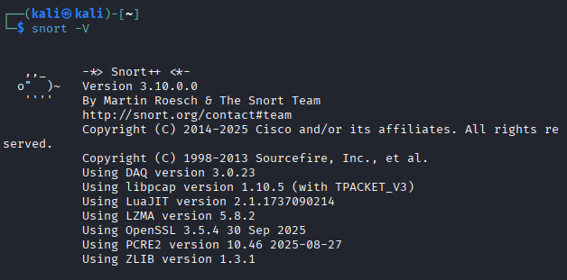

Durante la instalación, `apt` puede detectar que `/etc/snort/snort.lua` ya existe y preguntar qué hacer con él:

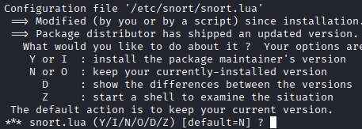

| Opción | Significado |
|---|---|
| `Y` | Reemplazar tu archivo por el nuevo (pierdes cambios) |
| `I` | Ver diferencias línea por línea |
| `N` | **Conservar tu archivo actual** (recomendado si ya tienes algo configurado) |
| `O` | Abrir el archivo nuevo sin instalarlo |
| `Z` | Abrir una shell para examinar la situación |

> **Nota:** Snort en modo monitor sobre WiFi no requiere estrictamente el modo bridge; son dos mecanismos de captura independientes (cableado vs. inalámbrico) que conviven en este mismo laboratorio.

## 2. Preparación de interfaces y bridge

Script: [`scripts/02-preparar-bridge.sh`](scripts/02-preparar-bridge.sh)

Primero eliminamos cualquier IP existente en las interfaces físicas que formarán el bridge, para garantizar un funcionamiento transparente:

```bash
sudo ip addr flush dev eth0
sudo ip addr flush dev eth1
```

A continuación creamos el bridge `br0` y le añadimos ambas interfaces:

```bash
sudo brctl addbr br0
sudo brctl addif br0 eth0
sudo brctl addif br0 eth1
```

Comprobamos con `ip a` que las interfaces quedan **UP** y sin IP asignada:

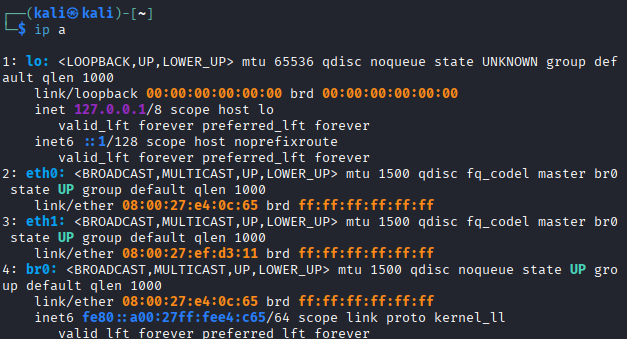

## 3. Desactivación de servicios y ajustes de red

Script: [`scripts/03-desactivar-servicios-red.sh`](scripts/03-desactivar-servicios-red.sh)

**Desactivación de NetworkManager.** Durante la configuración se detectó que `NetworkManager` reasignaba automáticamente direcciones IP por DHCP a las interfaces físicas del bridge, rompiendo el funcionamiento transparente del sensor. Para evitarlo, se detiene el servicio:

```bash
sudo systemctl stop NetworkManager
```

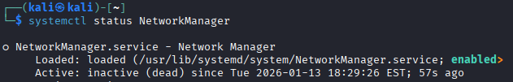

**Desactivación del reenvío IP**, para evitar que el equipo actúe como router:

```bash
echo 0 | sudo tee /proc/sys/net/ipv4/ip_forward
```

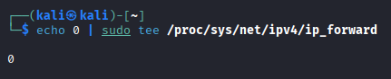

**Carga del módulo `br_netfilter`**, necesario para que el tráfico del bridge pueda ser filtrado/inspeccionado (no genera salida si se carga correctamente):

```bash
sudo modprobe br_netfilter
```

**Activación del filtrado de tráfico bridge en iptables/ip6tables**, para que todo el tráfico que atraviesa `br0` sea visible para Snort sin alterar el comportamiento transparente de la red:

```bash
sudo sysctl -w net.bridge.bridge-nf-call-iptables=1
sudo sysctl -w net.bridge.bridge-nf-call-ip6tables=1
```

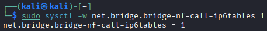
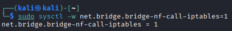

## 4. Comprobación de la configuración del bridge

Verificamos el resultado final con `brctl show`:

```bash
brctl show
```

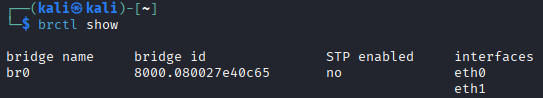

- **`br0`** → bridge creado correctamente.
- **STP: no** → correcto para un laboratorio en entorno controlado (STP no es obligatorio en un IDS transparente).
- **Interfaces asociadas** → `eth0` y `eth1` quedan correctamente enlazadas al bridge.

Esto confirma que el sistema está operando como un puente de red de capa 2.

## 5. Configuración de la interfaz WiFi en modo monitor

Script: [`scripts/04-modo-monitor-wifi.sh`](scripts/04-modo-monitor-wifi.sh)

Primero comprobamos que la antena inalámbrica está conectada y reconocida por el sistema:

```bash
lsusb
```

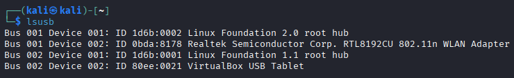

Matamos procesos que puedan interferir con el modo monitor (por ejemplo, `wpa_supplicant`):

```bash
sudo airmon-ng check kill
```

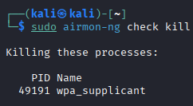

Y activamos el modo monitor en la interfaz:

```bash
sudo airmon-ng start wlan0
```

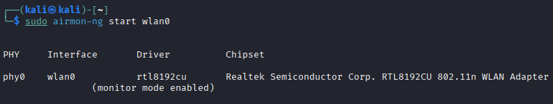

Con el driver `rtl8192cu`, `wlan0` pasa a operar directamente en modo monitor (usando encabezados radiotap) sin generar una interfaz adicional como `wlan0mon`. Debido a limitaciones de este driver, `tcpdump` no reconoce explícitamente el modo monitor con la opción `-I`, pero la captura de tráfico funciona correctamente sin forzar dicho parámetro.

## 6. Verificación de la antena con tcpdump

```bash
sudo tcpdump -i wlan0 -e -nn -c 20
```

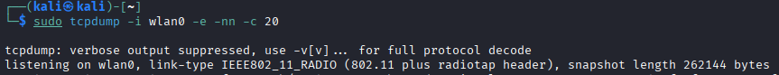

Significado de las opciones utilizadas:

| Opción | Función |
|---|---|
| `-i` | Interfaz de red a escuchar |
| `-e` | Muestra la cabecera de enlace (Ethernet/MAC) |
| `-n` | No resuelve direcciones IP a nombres de host |
| `-nn` | No resuelve IP ni puertos a nombres de servicio |
| `-c 20` | Captura solo 20 paquetes y se detiene automáticamente |

La salida confirma tramas Wi-Fi reales: `listening on wlan0` indica que tcpdump escucha en la interfaz puesta en modo monitor, y `link-type IEEE802_11_RADIO (802.11 plus radiotap header)` confirma que interpreta correctamente tráfico 802.11 (no Ethernet), incluyendo metadatos de señal (dBm, canal, velocidad, antena). Se reciben beacons de puntos de acceso cercanos, solicitudes de sondeo de clientes y datos cifrados, validando que la interfaz está lista para que Snort inspeccione el tráfico inalámbrico de manera pasiva.

## 7. Preparación del directorio de logs

Script: [`scripts/06-preparar-logs.sh`](scripts/06-preparar-logs.sh)

```bash
sudo mkdir -p /var/log/snort
sudo chown -R $USER:$USER /var/log/snort
```

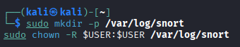

Esto crea el directorio donde Snort guardará alertas y capturas, y asegura permisos para el usuario actual.

## 8. Reglas de Snort

Fichero: [`scripts/rules/local.rules`](scripts/rules/local.rules)

```bash
sudo nano /etc/snort/rules/local.rules
```

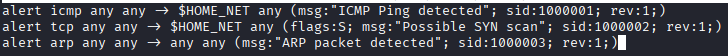

Reglas base del laboratorio:

```
alert icmp any any -> $HOME_NET any (msg:"ICMP Ping detected"; sid:1000001; rev:1;)
alert tcp any any -> $HOME_NET any (flags:S; msg:"Possible SYN scan"; sid:1000002; rev:1;)
alert arp any any -> any any (msg:"ARP packet detected"; sid:1000003; rev:1;)
```

- **`icmp any any -> $HOME_NET any`** → detecta cualquier tráfico ICMP (ping, echo request/reply) hacia la red local.
- **`flags:S`** → solo paquetes con el flag SYN activado, típico de un escaneo de puertos.
- **`arp any any -> any any`** → captura cualquier paquete ARP (resolución de direcciones MAC/IP).
- **`msg`** → mensaje que se muestra en la alerta.
- **`sid`** → identificador único de la regla; **`rev`** → número de revisión.

El fichero [`scripts/rules/local.rules`](scripts/rules/local.rules) de este repositorio añade además dos reglas de ejemplo para tráfico potencialmente malicioso (patrón `\x90\x90\x90` típico de shellcodes) y tráfico HTTP saliente, con SIDs únicos corregidos respecto a las pruebas iniciales del laboratorio.

## 9. HOME_NET y metodología de captura offline

Fichero: [`scripts/config/snort.conf.snippet`](scripts/config/snort.conf.snippet)

```bash
sudo nano /etc/snort/snort.conf
```

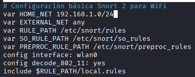

En este laboratorio se definió la red interna `192.168.1.0/24` como `HOME_NET`, junto con el path de reglas y la configuración del decodificador 802.11 (`config decode_802_11: yes`) para que Snort pueda interpretar correctamente las tramas inalámbricas capturadas.

Debido a las limitaciones del hardware WiFi y del motor DAQ de Snort 3, la inspección inalámbrica se realiza mediante captura en modo monitor y análisis inmediato/posterior de los paquetes, permitiendo una detección casi en tiempo real sin interferir en la red. Esto permite, incluso con las limitaciones del chipset Realtek RTL8192CU, monitorear y guardar paquetes para procesarlos con Snort más adelante:

```bash
sudo tcpdump -i wlan0 -e -nn -c 20 -w wifi.pcap
```

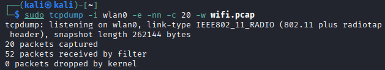

Al no disponer de un switch configurable con puerto espejo, se optó por esta metodología de **captura offline**: capturar el tráfico de red en ficheros `.pcap` con tcpdump, y analizarlos posteriormente con Snort en modo offline (script [`scripts/07-analizar-pcap-con-snort.sh`](scripts/07-analizar-pcap-con-snort.sh)). Este enfoque permite el análisis forense del tráfico sin necesidad de configuraciones complejas de red, manteniendo la capacidad de detección de intrusiones mediante las reglas de Snort.

## Limitaciones conocidas

- El driver `rtl8192cu` no responde correctamente a la opción `-I` de tcpdump para forzar el modo monitor; se usa la interfaz directamente sin ese parámetro.
- No se dispuso de un switch con puerto espejo (SPAN), por lo que la inspección del tráfico cableado en producción real debería completarse con dicho mecanismo o con un TAP de red; en este laboratorio se usó el bridge transparente como alternativa.
- STP está desactivado en el bridge, adecuado para un entorno de laboratorio controlado pero a revisar antes de un despliegue en producción.

---

## Uso rápido

```bash
git clone <url-de-este-repositorio>
cd tcpdump-snort-ids/scripts
chmod +x *.sh
./setup-completo.sh
```

Revisa y ajusta los nombres de interfaz (`eth0`, `eth1`, `wlan0`) dentro de cada script antes de ejecutarlos en tu propio entorno.
